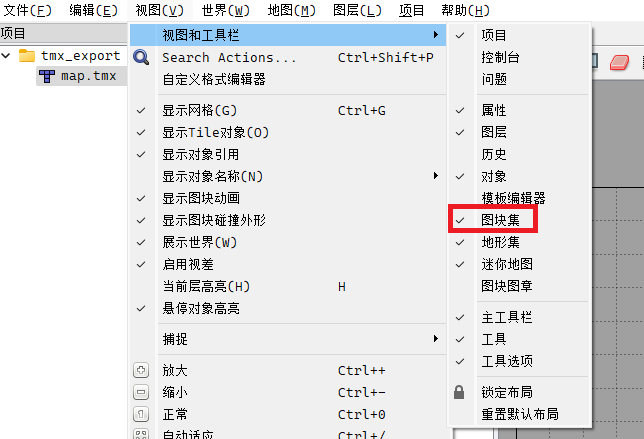
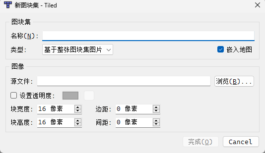

# gomapgen

gomapgen 是一个根据自定义模板生成地图文件的工具。

# 如何初始化模板

- 创建一个目录(例如：dawnlike)用于存放模板需要的文件
- 在dawnlike下按照素材类别进行分类，分类规则随意。
  - 注意：确保你的素材都是同一个规格的，也就是都为16x16或者32x32
- 在dawnlike下新建一个template.tmx
- 使用编辑器打开template.tmx
  - 推荐使用[Tiled](https://www.mapeditor.org/)编辑器创建一个地图
  - 使用vscode、notepad、notepad++或者submit也可以
## 如何完善模板文件template.tmx

### 使用Tiled编辑器

1. 创建地图保存为dawnlike目录下的template2.tmx 
   - 地图大小随意，块大小建议为素材中块的大小
2. 在编辑器菜单中找到“视图>视图和工具栏>图块集”，勾选如下：
3. 在右下角点到图块集面板，点击新图块集：
4. 在窗口中勾选嵌入地图：
5. 点击浏览，逐个打开dawnlike下的目录中的各个素材文件
6. 根据图块实际情况填写块宽度、块高度、边距以及间距
   - 通常块的宽度=高度，即一个块为16x16或者32x32
   - 边距为图片的上下左右空白边的像素个数。可能为0或者小于块高度的值
   - 间距为任意两个图块之间的间隔像素，通常为0或者1。
7. 循环3~6步，直到所有素材都被引入
8. 使用文本编辑器打开template2.tmx
9. 使用如下代码替换文件中的layer部分：
  ```gotemplate
  {{range .CSVs}} <layer name="{{.Name}}" width="{{.Width}}" height="{{.Height}}" visible="0">
    <data encoding="csv">
  {{.Values}}
    </data>
   </layer>{{end}}
  ```
10. 替换第二行的map部分中width和height的值为如下情况。如果没有backgroundcolor，可增加“backgroundcolor属性”：
```gotemplate
width="{{.Width}}" height="{{.Height}}" backgroundcolor="#000000"
```
11. 删除template.tmx，保存template2.tmx为template.tmx

### 使用vscode编辑器

其他编辑器类似，这里以vscode举例说明。

1. 使用vscode打开template.tmx
2. 填充模板代码：
```gotemplate
<?xml version="1.0" encoding="UTF-8"?>
<map version="1.10" tiledversion="1.10.1" orientation="orthogonal" renderorder="right-down" width="{{.Width}}" height="{{.Height}}" tilewidth="16" tileheight="16" infinite="0" nextlayerid="2" nextobjectid="1">

  {{range .CSVs}} <layer name="{{.Name}}" width="{{.Width}}" height="{{.Height}}" visible="0">
    <data encoding="csv">
      {{.Values}}
    </data>
  </layer>{{end}}
</map>
```
3. 在第三行增加图块集代码：
   - 图块集：一个图片称为一个图块集，也就是m行，n列的图块共同组成这张图片，图块间可能存在边距
   - source：dawnlike目录下，图片文件的路径。
   - width：图片的宽度，可以通过查看图片属性得到
   - height：图片的高度，可以通过查看图片属性得到
   - tilewidth：图块的宽度
   - tileheight：图块的高度
   - tilecount：图块集中一共包含了多少个块，可以省略这个属性
   - columns：图块集中图块的列数，可以省略这个属性
   - spacing: 相邻图块之间的间隔像素，为0时可以不写这个属性
   - margin: 图片上靠近图片边界的图块举例图片边界的像素，为0时可以不写这个属性
   - name： 这个图块集的名字，允许和其他图块集的名字重复，但是不建议重复
   - firstgid： 这个图块集合中第一个块的编号在所有图块集合的序号：为之前图块集中tilecount属性的值的总和再加1。如果是第一个图块集，编号为1；
```xml
<tileset firstgid="1" name="Wand" tilewidth="16" tileheight="16" spacing="0" margin="0" tilecount="56" columns="8">
  <image source="Items/Wand.png" width="128" height="112"/>
 </tileset>
```
4. 重复第3步，直到所有图块集都添加到文件中


## 完成编码部分

完成了template.tmx的制作后，我们需要根据template.tmx中图块集的编号去进行编码。
但是再编码前，我们需要把我们的素材文件夹（例如：dawnlike）拷贝到gmgmap目录下

### 分类


